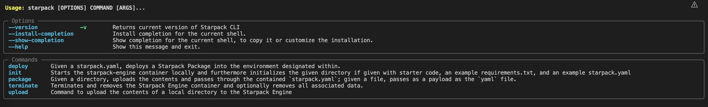

# 

[](https://badge.fury.io/py/starpack)

[](https://codecov.io/gh/a360-starpack/starpack)


Starpack is tool to package and deploy production-ready packages of maching learning models.

This repository contains the code for the CLI and Python library for interacting with Starpack. To run Starpack locally, you will a Python version listed in the badge above and [Docker Desktop](https://docs.docker.com/get-docker/) installed locally.

## Quickstart

To begin using Starpack, open a terminal and run 
```bash
pip install starpack
```

Then, you can initialize an existing or new directory with starter code and files by running the following in a terminal

```bash
starpack init ./path/you/want
```

Reconfigure your `starpack.yaml`, `predict.py`, and `requirements.txt` files to point to your model artifacts, properly ingest your data, and list your project dependencies, respectively. An example of these files can be found in the `examples` folder.

Finally, run the following terminal command to package and deploy your model locally

```bash
starpack deploy ./path/you/want
```


or alternatively in Python (such as in a notebook), the process can be run as follows:

```python
import starpack
from pathlib import Path

desired_directory = Path("./path/you/want")

starpack.init(desired_directory)

# Reconfigure your files that have been initialized for your specific project

starpack.deploy_directory(desired_directory)
```


## Full Command List

A full command list can be found by running

```bash
starpack --help
```

As of writing, the help command will display the following


